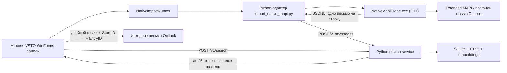

# Архитектура RAGSearch и роль MAPI

## Короткий вывод

RAGSearch — не монолит, в котором Python напрямую управляет Outlook. Получение
писем и поисковое ядро уже разделены отдельным процессом, JSONL и HTTP API.

Однако разделение пока половинчатое:

- API и схема базы данных всё ещё используют Outlook-специфичные идентификаторы;
- MAPI-адаптер физически лежит внутри каталога `service`;
- экспериментальный полный OOM ingestion удалён из основного C#-проекта;
- необходимые Extended MAPI headers и лицензия зафиксированы в Git на точном
  upstream commit.

Extended MAPI worker на C++ нужен как Outlook-specific connector. Его следует не
выбрасывать, а изолировать от нейтрального поискового ядра.

## Текущий поток данных



1. Кнопка **«Индексировать»** вызывает не старый Outlook-индексатор, а
   [`NativeImportRunner.RunAsync()`](../RAGSearch/NativeImportRunner.cs#L54).

2. Runner проверяет Python-сервис и затем запускает
   [`service/import_native_mapi.py`](../RAGSearch/NativeImportRunner.cs#L682).

3. Python-адаптер запускает
   [`NativeMapiProbe.exe --jsonl`](../service/import_native_mapi.py#L791). Сам
   Python MAPI-функции при этом не вызывает.

4. C++-процесс инициализирует MAPI, входит в default Outlook profile,
   перечисляет stores, папки и письма, после чего печатает JSONL:

   - [`MAPIInitialize`](../native-mapi-probe/main.cpp#L122);
   - [`MAPILogonEx`](../native-mapi-probe/main.cpp#L1691);
   - [перечисление stores](../native-mapi-probe/main.cpp#L1490);
   - [выдача JSONL](../native-mapi-probe/main.cpp#L1105).

5. Python-адаптер валидирует JSON, контролирует пути временных файлов вложений и
   отправляет каждое письмо обычным HTTP POST в `/v1/messages`:
   [`post_message`](../service/import_native_mapi.py#L643).

6. Поисковый Python-сервис валидирует DTO, разбивает metadata, body и attachments
   на чанки, считает embeddings и записывает данные в SQLite:
   [`SearchService._ingest_one`](../service/ragsearch_service/app.py#L168).

7. При поиске VSTO отправляет запрос в `/v1/search` с пустыми filters и лимитом
   25: [`SearchPaneControl.SearchAsync`](../RAGSearch/SearchPaneControl.cs#L632).
   Результаты последовательно добавляются в собственный нижний WinForms
   `DataGridView`, без повторной сортировки, поэтому сохраняют порядок backend:
   [`PopulateResults`](../RAGSearch/SearchPaneControl.cs#L733). Штатные Search bar,
   текущая папка и список Outlook не изменяются.

8. Двойной щелчок по строке (или `Enter`) передаёт точные `entry_id` и `store_id`
   из результата в `NameSpace.GetItemFromID`, после чего исходный `MailItem`
   открывается отдельным окном Outlook:
   [`OpenSearchResult`](../RAGSearch/ThisAddIn.cs#L115). Этот небольшой UI/navigation
   слой закономерно остаётся Outlook-зависимым.

## Что такое MAPI

В проекте используется **Extended Messaging Application Programming Interface** —
низкоуровневый локальный API Outlook/Exchange. Это не REST API, не
MAPI-over-HTTP и не Python-пакет.

Extended MAPI предоставляет доступ к:

- настроенному Outlook profile;
- message stores;
- PST и текущему Exchange/OST store через установленные providers;
- папкам, письмам, свойствам и вложениям.

Код не парсит `.pst` или `.ost` как файлы. Он обращается к store provider через
MAPI. Поэтому открытый и заблокированный процессом Outlook файл OST не нужно
копировать или читать напрямую.

## Откуда взялось MAPI

Под названием MAPI здесь скрываются три разных компонента.

| Компонент | Источник |
|---|---|
| Шесть Extended MAPI headers для компиляции | Зафиксированы в `third_party/MAPIStubLibrary` из официального [Microsoft MAPIStubLibrary](https://github.com/microsoft/MAPIStubLibrary) |
| `MAPI32.lib` для линковки | Имеющийся Windows/Visual Studio toolchain |
| Рабочая реализация MAPI во время выполнения | Системный `mapi32.dll` перенаправляет вызовы в MAPI-подсистему установленного classic Outlook |

12 августа 2026 года dependency был повторно получен из upstream и закреплён на
commit `a9505d73351554078431fc950a0bc34ada6fe39b`. В Git внесены минимальный
транзитивный набор из шести headers, upstream MIT-лицензия и provenance с
процедурой обновления: [`third_party/MAPIStubLibrary`](../third_party/MAPIStubLibrary/README.md).

Таким образом:

- рабочую MAPI-подсистему и provider даёт установленный classic Outlook;
- системный dispatcher/stub присутствует в Windows;
- developer headers с обычным Office на этой машине не установились и были
  скачаны отдельно.

Microsoft также описывает headers как отдельную загрузку из MAPIStubLibrary:
[Install MAPI header files](https://learn.microsoft.com/en-us/office/client-developer/outlook/mapi/how-to-install-mapi-header-files).

### Состояние воспроизводимости

Исходные зависимости native worker теперь находятся в Git. Готовый EXE по-прежнему
сознательно не хранится: `build-direct` игнорируется. MSBuild и CMake настроены
выдавать `NativeMapiProbe.exe` именно в этот канонический каталог, который ожидает
[`NativeImportRunner.cs`](../RAGSearch/NativeImportRunner.cs#L664).

На текущей машине отсутствует штатный Visual Studio C++ workload, поэтому здесь
используется имеющийся x64 compiler ScopeCppSDK. Для обычной чистой сборки нужно
установить `Desktop development with C++`; скачивать MAPI headers уже не требуется.

## Зачем нужен C++

Основная причина техническая: Extended MAPI является unmanaged API. Microsoft
поддерживает его прямое использование из C/C++. Использование MAPI из managed
C#/VB через обычный .NET interop не поддерживается, а напрямую из скриптов MAPI
не является scriptable API.

Кроме того, битность MAPI-процесса должна совпадать с Outlook. В текущей системе
и Outlook, и worker — x64.

Это описано в документации Microsoft:
[Selecting an API or technology for developing solutions for Outlook](https://learn.microsoft.com/en-us/office/client-developer/outlook/selecting-an-api-or-technology-for-developing-solutions-for-outlook).

Отдельный EXE даёт и дополнительные преимущества:

- native MAPI objects не загружаются внутрь процесса Outlook/VSTO;
- сбой worker меньше рискует уронить Outlook;
- сообщения можно стримить по одному, не накапливая mailbox в памяти;
- процесс можно независимо остановить;
- граница с остальной системой остаётся обычным JSONL.

Следовательно, C++ оправдан как реализация Outlook/MAPI connector. Неудачной
остаётся его упаковка: компонент всё ещё называется `probe`, не включён в общую
сборку и не поставляется installer-ом.

## Почему был выбран Extended MAPI

Защищённые свойства Outlook Object Model могут вызывать Object Model Guard.
Microsoft перечисляет такие свойства отдельно в
[Protected Properties and Methods](https://learn.microsoft.com/en-us/office/vba/outlook/how-to/security/protected-properties-and-methods).

Задача прототипа состояла в чтении локального PST и текущего Exchange/OST store
при сохранении strict security policy. Поэтому production ingestion читает store
provider через Extended MAPI, а не вызывает защищённые getters вроде
`MailItem.SenderEmailAddress`.

Native worker не запрашивает write-флаги и не содержит операций отправки,
сохранения, создания или удаления Outlook items. Запись на диск ограничена
временным spool вложений.

## Где действительно присутствуют Outlook и MAPI в Python

### Production search core

В `service/ragsearch_service` нет `win32com`, `Outlook.Application` или прямых
MAPI-вызовов. Runtime по умолчанию использует только standard library:
[`requirements.txt`](../service/requirements.txt#L1).

### `service/import_native_mapi.py`

Это не поисковое ядро, а Outlook/MAPI connector adapter. Он:

- запускает native worker;
- проверяет его JSONL contract;
- контролирует spool;
- преобразует native record в DTO сервиса;
- отправляет DTO через HTTP.

Адаптер обязан понимать такие поля, как `store_id`, `body_truncated` и временные
пути вложений. Проблема не в этой обязанности, а в том, что adapter находится
внутри каталога `service` и поэтому выглядит частью core.

## Удалённый legacy Outlook Object Model code

12 августа 2026 года из production-проекта удалены недостижимые
`OutlookIndexer`, `OutlookItemExtractor`, их DTO, C# ingestion client method и
лишний Python `win32com` probe. Рабочая diagnostic-кнопка
[`OomGuardProbe`](../RAGSearch/OomGuardProbe.cs#L10) сохранена: она выполняет
ровно один явно запрошенный protected getter и не индексирует сообщения.

## Насколько система независима от источника

Транспортная граница уже существует: любой producer технически может отправить
JSON в `/v1/messages`.

Но domain contract остаётся Outlook-specific. Сейчас обязательны:

- `entry_id`;
- `store_id`;
- `folder_entry_id`.

Они требуются в
[`SearchService._normalize_message`](../service/ragsearch_service/app.py#L79), а
база закрепляет identity как `UNIQUE(store_id, entry_id)`:
[`database.py`](../service/ragsearch_service/database.py#L63).

Поэтому новый Graph, IMAP, EML или filesystem producer должен притворяться
Outlook и изобретать эти значения. Это означает, что implementation уже отделена
от источника, но domain model ещё не отделена.

## Почему недостаточно принимать только строку текста

Для устойчивой индексации кроме текста необходимы:

- стабильный source key для повторного upsert, reconciliation и удаления;
- provenance, показывающий происхождение документа;
- locator, позволяющий открыть оригинал;
- title, авторы, даты и фильтруемые metadata;
- границы body, attachments и других частей документа.

Но эти данные не обязаны называться в терминах Outlook. Нейтральный contract может
выглядеть так:

```text
source_key = connector + namespace + item_id
kind       = email | file | note | ...
title
parts[]    = body / attachment / metadata
metadata
locator    = непрозрачный объект конкретного connector
```

Search core использует `source_key` для upsert и возвращает `locator`, не пытаясь
интерпретировать его. Outlook connector хранит внутри locator `store_id`,
`entry_id` и `folder_entry_id`; другой connector использует собственные данные.

## Предлагаемая целевая граница

```text
connectors/
  outlook_mapi/
    native/            # C++ Extended MAPI reader
    adapter.py         # MAPI JSONL -> canonical document

core/
  domain.py            # Document / Part / SourceKey / opaque Locator
  ingest.py            # normalization, chunking, embeddings
  search.py

infrastructure/
  sqlite_repository.py
  attachment_store.py

hosts/
  outlook_vsto/        # собственный Outlook UI и открытие оригиналов по locator

diagnostics/
  outlook_oom_guard/   # OomGuardProbe и guard scripts
```

Минимальный практический порядок исправления:

1. Перенести `OomGuardProbe` и PowerShell guard probe в diagnostics.
2. Перенести C++ worker и `import_native_mapi.py` в единый
   `connectors/outlook_mapi`.
3. Ввести нейтральный `/v1/documents` с `source_key`, `parts`, `metadata` и
   opaque `locator`; старый `/v1/messages` временно оставить compatibility
   adapter-ом.
4. Перевести БД с обязательных Outlook IDs на нейтральную source identity.
5. Подключить native worker и VSTO к единой installer/release-сборке.

## Итог

C++ Extended MAPI worker нужен и выбран осмысленно: он является локальным
Outlook-specific источником данных и позволяет читать настроенные stores без
Outlook Object Model ingestion.

Python search core уже не управляет Outlook. Но вокруг первоначального
эксперимента остались прототипные швы: Outlook-shaped API и база, adapter внутри
`service`, общий spool и раздельная native/VSTO release-сборка.

Правильное направление — сохранить MAPI worker как connector и сделать внутренний
документный контракт независимым от способа получения данных.
