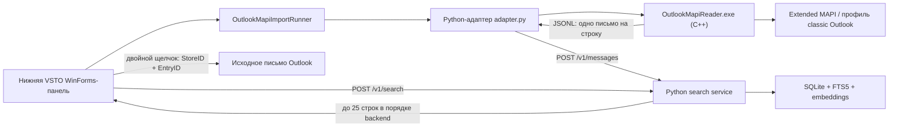

# Архитектура RAGSearch и роль MAPI

## Короткий вывод

RAGSearch — не монолит, в котором Python напрямую управляет Outlook. Получение
писем и поисковое ядро уже разделены отдельным процессом, JSONL и HTTP API.

Физические границы компонентов теперь отражены деревом каталогов, но domain model
пока остаётся Outlook-shaped:

- API и схема базы данных всё ещё используют Outlook-специфичные идентификаторы;
- Outlook/MAPI reader и adapter изолированы в `connectors/outlook_mapi`;
- экспериментальный Outlook Object Model ingestion и diagnostics удалены из
  production tree;
- необходимые Extended MAPI headers и лицензия зафиксированы в Git на точном
  upstream commit.

Extended MAPI reader на C++ нужен как Outlook-specific connector. Его следует не
выбрасывать, а изолировать от нейтрального поискового ядра.

## Текущий поток данных



1. Кнопка **«Индексировать»** вызывает не старый Outlook-индексатор, а
   [`OutlookMapiImportRunner.RunAsync()`](../hosts/outlook_vsto/OutlookMapiImportRunner.cs#L58).

2. Runner проверяет Python-сервис и затем запускает
   [`connectors/outlook_mapi/adapter.py`](../hosts/outlook_vsto/OutlookMapiImportRunner.cs#L237).

3. Python-адаптер запускает
   [`OutlookMapiReader.exe --jsonl`](../connectors/outlook_mapi/adapter.py#L820). Сам
   Python MAPI-функции при этом не вызывает.

4. C++-процесс инициализирует MAPI, входит в default Outlook profile,
   перечисляет stores, папки и письма, после чего печатает JSONL:

   - [`MAPIInitialize`](../connectors/outlook_mapi/native/main.cpp#L122);
   - [`MAPILogonEx`](../connectors/outlook_mapi/native/main.cpp#L1667);
   - [перечисление stores](../connectors/outlook_mapi/native/main.cpp#L1458);
   - [выдача JSONL](../connectors/outlook_mapi/native/main.cpp#L1070).

5. Python-адаптер валидирует JSON, контролирует пути временных файлов вложений и
   отправляет каждое письмо обычным HTTP POST в `/v1/messages`:
   [`post_message`](../connectors/outlook_mapi/adapter.py#L668).

6. Поисковый Python-сервис валидирует DTO, разбивает metadata, body и attachments
   на чанки, считает embeddings и записывает данные в SQLite:
   [`SearchService._ingest_one`](../service/ragsearch_service/app.py#L175).

7. При поиске VSTO отправляет запрос в `/v1/search` с текстом запроса и лимитом
   25: [`SearchPaneControl.SearchAsync`](../hosts/outlook_vsto/SearchPaneControl.cs#L798).
   Результаты последовательно добавляются в собственный нижний WinForms
   `DataGridView`, без повторной сортировки, поэтому сохраняют порядок backend:
   [`PopulateResults`](../hosts/outlook_vsto/SearchPaneControl.cs#L898). Штатные Search bar,
   текущая папка и список Outlook не изменяются.

8. Двойной щелчок по строке (или `Enter`) передаёт точные `entry_id` и `store_id`
   из результата в `NameSpace.GetItemFromID`, после чего исходный `MailItem`
   открывается отдельным окном Outlook:
   [`OpenSearchResult`](../hosts/outlook_vsto/ThisAddIn.cs#L93). Этот небольшой UI/navigation
   слой закономерно остаётся Outlook-зависимым.

## Что такое MAPI

В проекте используется **Extended Messaging Application Programming Interface** —
низкоуровневый локальный API Outlook/Exchange. Это не REST API, не
MAPI-over-HTTP и не Python-пакет.

Extended MAPI предоставляет доступ к:

- настроенному Outlook profile;
- message stores;
- PST и текущему Exchange/OST store через установленные providers;
- папкам, письмам, свойствам и вложениям.

Код не парсит `.pst` или `.ost` как файлы. Он обращается к store provider через
MAPI. Поэтому открытый и заблокированный процессом Outlook файл OST не нужно
копировать или читать напрямую.

## Откуда взялось MAPI

Под названием MAPI здесь скрываются три разных компонента.

| Компонент | Источник |
|---|---|
| Шесть Extended MAPI headers для компиляции | Зафиксированы в `third_party/MAPIStubLibrary` из официального [Microsoft MAPIStubLibrary](https://github.com/microsoft/MAPIStubLibrary) |
| `MAPI32.lib` для линковки | Имеющийся Windows/Visual Studio toolchain |
| Рабочая реализация MAPI во время выполнения | Системный `mapi32.dll` перенаправляет вызовы в MAPI-подсистему установленного classic Outlook |

12 августа 2026 года dependency был повторно получен из upstream и закреплён на
commit `a9505d73351554078431fc950a0bc34ada6fe39b`. В Git внесены минимальный
транзитивный набор из шести headers, upstream MIT-лицензия и provenance с
процедурой обновления: [`third_party/MAPIStubLibrary`](../third_party/MAPIStubLibrary/README.md).

Таким образом:

- рабочую MAPI-подсистему и provider даёт установленный classic Outlook;
- системный dispatcher/stub присутствует в Windows;
- developer headers с обычным Office на этой машине не установились и были
  скачаны отдельно.

Microsoft также описывает headers как отдельную загрузку из MAPIStubLibrary:
[Install MAPI header files](https://learn.microsoft.com/en-us/office/client-developer/outlook/mapi/how-to-install-mapi-header-files).

### Состояние воспроизводимости

Исходные зависимости native reader находятся в Git. Готовый EXE по-прежнему
сознательно не хранится. Единственный поддерживаемый build system — MSBuild;
Debug и Release outputs разделены:
`connectors/outlook_mapi/native/bin/x64/<Configuration>/OutlookMapiReader.exe`.
Их ожидает
[`OutlookMapiImportRunner.cs`](../hosts/outlook_vsto/OutlookMapiImportRunner.cs#L712).

На текущей машине установлен штатный Visual Studio workload
`Desktop development with C++`. Канонический полный `Debug|x64` Rebuild решения и
отдельный `Release|x64` Rebuild native reader через MSVC v143 прошли без warnings и
errors. Для чистого clone требуется тот же workload; скачивать MAPI headers отдельно
не нужно.

## Зачем нужен C++

Основная причина техническая: Extended MAPI является unmanaged API. Microsoft
поддерживает его прямое использование из C/C++. Использование MAPI из managed
C#/VB через обычный .NET interop не поддерживается, а напрямую из скриптов MAPI
не является scriptable API.

Кроме того, битность MAPI-процесса должна совпадать с Outlook. В текущей системе
и Outlook, и reader — x64.

Это описано в документации Microsoft:
[Selecting an API or technology for developing solutions for Outlook](https://learn.microsoft.com/en-us/office/client-developer/outlook/selecting-an-api-or-technology-for-developing-solutions-for-outlook).

Отдельный EXE даёт и дополнительные преимущества:

- native MAPI objects не загружаются внутрь процесса Outlook/VSTO;
- сбой reader меньше рискует уронить Outlook;
- сообщения можно стримить по одному, не накапливая mailbox в памяти;
- процесс можно независимо остановить;
- граница с остальной системой остаётся обычным JSONL.

Следовательно, C++ оправдан как реализация Outlook/MAPI connector. Production
компонент теперь называется `OutlookMapiReader` и лежит рядом со своим adapter.
Открытым packaging-вопросом остаётся installer/release-поставка; native проект
включён в `RAGSearch.sln` и собирается общей конфигурацией через
`scripts/build.ps1`.

## Почему был выбран Extended MAPI

Защищённые свойства Outlook Object Model могут вызывать Object Model Guard.
Microsoft перечисляет такие свойства отдельно в
[Protected Properties and Methods](https://learn.microsoft.com/en-us/office/vba/outlook/how-to/security/protected-properties-and-methods).

Задача прототипа состояла в чтении локального PST и текущего Exchange/OST store
при сохранении strict security policy. Поэтому production ingestion читает store
provider через Extended MAPI, а не вызывает защищённые getters вроде
`MailItem.SenderEmailAddress`.

Native reader не запрашивает write-флаги и не содержит операций отправки,
сохранения, создания или удаления Outlook items. Запись на диск ограничена
временным spool вложений.

## Где действительно присутствуют Outlook и MAPI в Python

### Production search core

В `service/ragsearch_service` нет `win32com`, `Outlook.Application` или прямых
MAPI-вызовов. Runtime по умолчанию использует только standard library:
[`requirements.txt`](../service/requirements.txt#L1).

### `connectors/outlook_mapi/adapter.py`

Это не поисковое ядро, а Outlook/MAPI connector adapter. Он:

- запускает native reader;
- проверяет его JSONL contract;
- контролирует spool;
- преобразует native record в DTO сервиса;
- отправляет DTO через HTTP.

Адаптер обязан понимать такие поля, как `store_id`, `body_truncated` и временные
пути вложений. Теперь эта source-specific обязанность явно локализована в каталоге
connector, а не выглядит частью search core.

## Удалённый экспериментальный Outlook Object Model code

12 августа 2026 года из production-проекта удалены недостижимые
`OutlookIndexer`, `OutlookItemExtractor`, их DTO, C# ingestion client method,
Python `win32com` probe, OOM diagnostic UI и startup trace. Production VSTO host
не содержит protected Outlook Object Model getters для ingestion или diagnostics.

## Насколько система независима от источника

Транспортная граница уже существует: любой producer технически может отправить
JSON в `/v1/messages`.

Но domain contract остаётся Outlook-specific. Сейчас обязательны:

- `entry_id`;
- `store_id`;
- `folder_entry_id`.

Они требуются в
[`SearchService._normalize_message`](../service/ragsearch_service/app.py#L86), а
база закрепляет identity как `UNIQUE(store_id, entry_id)`:
[`database.py`](../service/ragsearch_service/database.py#L93).

Поэтому новый Graph, IMAP, EML или filesystem producer должен притворяться
Outlook и изобретать эти значения. Это означает, что implementation уже отделена
от источника, но domain model ещё не отделена.

## Почему недостаточно принимать только строку текста

Для устойчивой индексации кроме текста необходимы:

- стабильный source key для повторного upsert, reconciliation и удаления;
- provenance, показывающий происхождение документа;
- locator, позволяющий открыть оригинал;
- title, авторы, даты и фильтруемые metadata;
- границы body, attachments и других частей документа.

Но эти данные не обязаны называться в терминах Outlook. Нейтральный contract может
выглядеть так:

```text
source_key = connector + namespace + item_id
kind       = email | file | note | ...
title
parts[]    = body / attachment / metadata
metadata
locator    = непрозрачный объект конкретного connector
```

Search core использует `source_key` для upsert и возвращает `locator`, не пытаясь
интерпретировать его. Outlook connector хранит внутри locator `store_id`,
`entry_id` и `folder_entry_id`; другой connector использует собственные данные.

## Целевая граница (source-specific часть реализована)

```text
connectors/
  outlook_mapi/
    native/            # C++ Extended MAPI reader
    adapter.py         # MAPI JSONL -> текущий HTTP ingestion contract

core/                   # следующий логический этап
  domain.py            # Document / Part / SourceKey / opaque Locator
  ingest.py            # normalization, chunking, embeddings
  search.py

infrastructure/         # следующий логический этап
  sqlite_repository.py
  attachment_store.py

hosts/
  outlook_vsto/        # собственный Outlook UI и открытие оригиналов по locator
```

Состояние минимального практического порядка исправления:

1. **Выполнено:** экспериментальный OOM diagnostic contour удалён из production
   tree вместе с launcher, UI и startup trace.
2. **Выполнено:** C++ reader и Python adapter собраны в едином
   `connectors/outlook_mapi`, production-имя `probe` устранено.
   VSTO UI/host также перенесён в `hosts/outlook_vsto` без изменения assembly и
   deployment identity.
3. **Следующий логический этап:** заменить `/v1/messages` нейтральным
   `/v1/documents` с `source_key`, `parts`, `metadata` и opaque `locator` одним
   изменением всех producer/consumer, без compatibility endpoint.
4. Перевести БД с обязательных Outlook IDs на нейтральную source identity.
5. Подключить native reader и VSTO к единой installer/release-сборке.

## Итог

C++ Extended MAPI reader нужен и выбран осмысленно: он является локальным
Outlook-specific источником данных и позволяет читать настроенные stores без
Outlook Object Model ingestion.

Python search core уже не управляет Outlook, а source-specific код физически
изолирован в connector. Вокруг первоначального эксперимента остаются логические
швы: Outlook-shaped API и база, общий spool и незавершённая installer/release-сборка.

Правильное направление — сохранить MAPI reader как connector и сделать внутренний
документный контракт независимым от способа получения данных.
