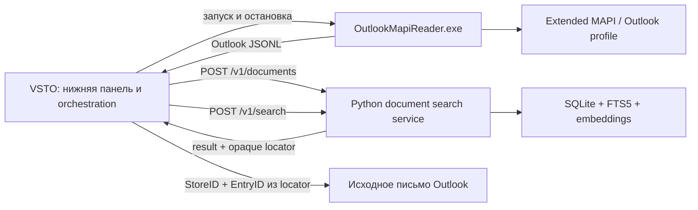

# Архитектура RAGSearch и роль MAPI

## Короткий вывод

В production-потоке RAGSearch осталось три процесса:

1. VSTO-host внутри classic Outlook управляет UI и всем жизненным циклом импорта.
2. `OutlookMapiReader.exe` читает Outlook profile через Extended MAPI и выдаёт
   source-specific JSONL.
3. Python search service принимает нейтральные документы по HTTP, индексирует их и
   выполняет поиск.

C++ не запускает Python, не знает URL или HTTP-контракт. Python не запускает C++,
не импортирует Outlook/MAPI-код и не читает созданные native-процессом пути. Ранее
стоявший между ними `adapter.py` удалён; его orchestration и единственное нужное
преобразование данных выполняет уже существующий VSTO-host.

## Фактический поток данных



Стрелки `C++ -> Python` нет. VSTO последовательно читает одну JSONL-запись,
преобразует её в один нейтральный `Document`, дожидается HTTP-ответа сервиса и
только затем читает следующую. Это даёт естественный backpressure и не накапливает
mailbox в памяти.

| Компонент | Ответственность | Чего он не знает |
|---|---|---|
| VSTO host | UI, запуск reader/service, cancellation, JSONL mapping, HTTP, открытие результата | внутренняя схема SQLite и реализация MAPI |
| C++ reader | read-only Extended MAPI, source-specific JSONL, bounded extraction вложений | Python, HTTP, token, search model |
| Python service | neutral documents, parts, chunking, embeddings, SQLite, search | Outlook, MAPI, native EXE и filesystem paths producer-а |

Внутренние Python-модули `app.py`, `database.py`, `chunking.py` и
`attachments.py` — обычные части одного процесса, а не дополнительные узлы
runtime-графа. Отдельные `core/`, `infrastructure/` или новый adapter-слой ради
самой слоистости не создаются.

## Две честные границы

### C++ reader -> VSTO

Reader остаётся Outlook-specific connector. В его JSONL закономерно присутствуют
`store_id`, `entry_id`, `folder_entry_id`, MAPI metadata и сведения о вложениях.
Это локальный pipe-контракт между connector и его host, а не domain model поискового
сервиса.

Native-процесс получает от VSTO отдельный каталог одного запуска. Для
`ATTACH_BY_VALUE` он может создать там bounded temporary file и указать его в
JSONL. Reader не выбирает общий application directory и не передаёт путь Python.

### VSTO -> Python service

Публичная ingestion-граница — только `POST /v1/documents`. В запросе находится
один полный snapshot документа:

```json
{
  "source_key": "outlook_mapi:<64-hex-sha256>",
  "kind": "email",
  "title": "План запуска продукта",
  "metadata": {
    "sender_name": "Алексей",
    "sender_email": "alex@example.test",
    "to": "user@example.test",
    "cc": "",
    "received_at": "2026-08-11T09:00:00Z",
    "folder_path": "Mailbox/Inbox",
    "store_name": "Mailbox",
    "internet_message_id": "<id@example.test>"
  },
  "locator": {
    "connector": "outlook_mapi",
    "store_id": "...",
    "entry_id": "...",
    "folder_entry_id": "..."
  },
  "parts": [
    {
      "key": "body",
      "kind": "body",
      "media_type": "text/plain",
      "text": "Текст письма",
      "truncated": false
    },
    {
      "key": "attachment:0",
      "kind": "attachment",
      "name": "notes.txt",
      "media_type": "text/plain",
      "size": 123,
      "content_base64": "..."
    }
  ]
}
```

- `source_key` — единственная identity для idempotent upsert. Outlook producer
  детерминированно строит её из пары StoreID/EntryID.
- `kind`, `title`, `metadata` и `parts` — нейтральные данные для поиска.
- `locator` — bounded JSON, который service хранит и возвращает без интерпретации.
  Только Outlook host знает, что внутри него означают StoreID и EntryID.
  Зарезервированный ключ `__type` запрещён на wire boundary из-за специальной
  семантики legacy .NET JSON serializer; остальные ключи остаются opaque.
- `internet_message_id` остаётся metadata: поле бывает пустым, меняется между
  системами и не подходит для локальной identity.

Старого `/v1/messages` и compatibility mapping нет. Ошибочный документ получает
обычный non-2xx HTTP-ответ; успешный полный snapshot заменяет части только своего
`source_key`.

`GET /health` возвращает номер protocol contract. VSTO принимает только protocol
`4` и явно просит завершить старый процесс service при несовпадении, поэтому
остаточный процесс от schema/API v3 не маскируется под совместимый backend.

## Жизненный цикл вложения без общего spool

1. VSTO создаёт приватный каталог конкретного запуска в своём локальном runtime
   каталоге `%LOCALAPPDATA%\RAGSearch\reader-runs`.
2. VSTO передаёт его reader-у через `--attachment-dir`.
3. Reader сохраняет только bounded `ATTACH_BY_VALUE` streams и пишет путь в свой
   JSONL. Embedded/OLE/by-reference attachments остаются metadata-only.
4. VSTO канонизирует путь и принимает только обычный файл строго внутри созданного
   им каталога.
5. VSTO кодирует содержимое в `content_base64` нейтрального part и отправляет один
   HTTP request.
6. Service декодирует bytes, извлекает поддерживаемый текст и не сохраняет producer
   path.
7. После синхронного ответа VSTO удаляет файлы и в конце — собственный каталог.

Таким образом, путь не пересекает HTTP boundary, а у временного файла ровно один
владелец. В Python service больше нет `spool_dir`, `--spool-dir` или
`--delete-spool-after-ingest`.

Inline base64 выбран осознанно для небольшого локального проекта: он оставляет
обычный JSON/HTTP-контракт и не добавляет multipart parser или upload service.
Размер одного native attachment, суммарный inline content одного документа и общий
HTTP request ограничены; вложения сверх бюджета остаются индексируемыми по имени и
metadata без content. Production host передаёт не более 8 MiB binary content на
документ; reader применяет тот же per-message бюджет до записи файлов, а service
повторно проверяет decoded размер. Перед отправкой VSTO измеряет уже полностью
сериализованный UTF-8 JSON и применяет тот же 48 MiB HTTP cap, что и service.

## Нейтральная модель хранения

Локальная schema хранит:

- `documents` с уникальным `source_key`, `kind`, `title`, сериализованными
  `metadata` и `locator`;
- `parts` с producer-defined `part_key`, kind/name/media type и статусом извлечения;
- `chunks`, привязанные к document и part.

Search core агрегирует результаты по document identity и возвращает `source_key`,
`kind`, `title`, `metadata`, opaque `locator`, snippet и matched parts. В tie-break,
SQL identity и API больше не участвуют Outlook IDs.

Outlook-host ограничивает producer title 65 536 символами. Search response читается
потоково со строгим UTF-8 и hard cap 128 MiB; тот же предел установлен у JSON parser.
Это оставляет bounded envelope даже при 25 результатах с opaque metadata/locator и
не добавляет отдельный response-adapter.

Переход намеренно является clean schema break: старую локальную БД нужно очистить
и заново построить. Это индекс, воспроизводимый из Outlook, поэтому поддерживать
две domain model или сложную миграцию хуже явной переиндексации.

## Открытие исходного письма

Поиск возвращает locator без попытки понять его на backend. VSTO проверяет
`connector == "outlook_mapi"`, извлекает `store_id` и `entry_id` и на Outlook
UI/STA thread вызывает:

```csharp
session.GetItemFromID(result.LocatorEntryId, result.LocatorStoreId);
```

Этот маленький navigation layer закономерно остаётся Outlook-specific. Если письмо
после индексации перемещено, удалено или его PST отключён, сохранённый locator может
перестать разрешаться; требуется переиндексация.

## Что такое Extended MAPI

Extended Messaging Application Programming Interface — низкоуровневый локальный
API Outlook/Exchange. Это не REST API, не MAPI-over-HTTP и не Python-пакет.

Reader обращается к настроенному Outlook profile и его store providers. Он не
парсит `.pst` или `.ost` как файлы, поэтому открытый и заблокированный Outlook OST
не нужно копировать или читать напрямую.

C++ выбран по технической границе: Microsoft поддерживает Extended MAPI из
unmanaged C/C++, тогда как прямой managed interop не является поддержанным путём.
Отдельный EXE также не загружает native MAPI objects в Outlook/VSTO process и
ограничивает последствия сбоя reader-а.

Reader использует MAPI read-only: не запрашивает write flags и не отправляет, не
создаёт, не сохраняет и не удаляет Outlook items. Временная запись на диск
ограничена явно переданным каталогом вложений одного запуска.

## Откуда берётся MAPI

| Компонент | Источник |
|---|---|
| Extended MAPI headers | Зафиксированный набор из официального Microsoft MAPIStubLibrary |
| `MAPI32.lib` | Windows/Visual Studio toolchain |
| Runtime implementation | `mapi32.dll` и MAPI subsystem установленного classic Outlook |

Headers закреплены в [`third_party/MAPIStubLibrary`](../third_party/MAPIStubLibrary)
на upstream commit `a9505d73351554078431fc950a0bc34ada6fe39b`. В Git находятся
необходимые headers, upstream MIT license и provenance; готовый EXE в Git не
хранится.

Единственный поддерживаемый build system — MSBuild. Solution собирает VSTO host и
native x64 reader, а Debug/Release outputs разделены:
`connectors/outlook_mapi/native/bin/x64/<Configuration>/OutlookMapiReader.exe`.

## Удалённые контуры

- Экспериментальный Outlook Object Model ingestion и diagnostics удалены из
  production tree.
- Python `adapter.py`, его progress protocol и adapter-specific tests удалены.
- `/v1/messages`, Outlook-shaped database identity и public Outlook filters удалены.
- Общий filesystem spool и двойное удаление файлов reader/adapter/service удалены.

Оставшийся graph минимален для поставленной задачи: UI/host, source connector и
поисковый сервис. Installer/release packaging, incremental checkpoints,
notifications и reconciliation удалённых писем остаются отдельными следующими
задачами и не требуют возвращать adapter-слой.
